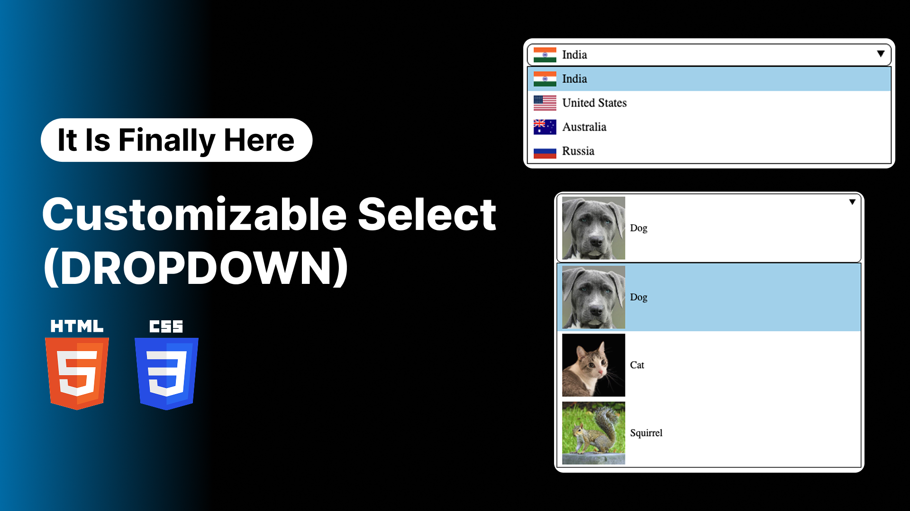

# Game-Changing Custom Select Element in HTML CSS | Customizable Dropdown Using HTML CSS

After years of workarounds, developers can finally fully customize the native HTML <select> element using pure HTML and CSS. This new feature provides complete styling flexibility—no JavaScript hacks or external libraries needed. It's a huge leap forward for creating modern, accessible, and fully custom dropdowns with ease.